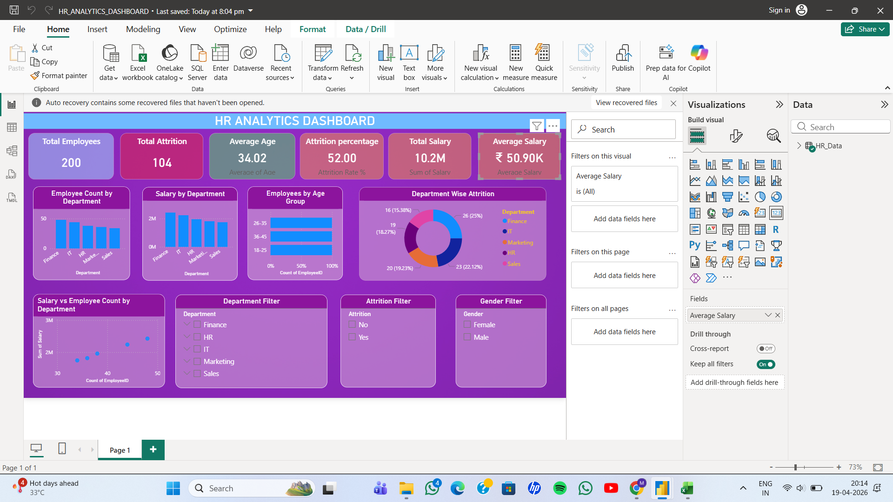

# HR-Analytics-Dashboard
# HR Analytics Dashboard (Power BI)

## Project Overview
This project presents an interactive HR Analytics Dashboard built using Power BI.  
The dashboard helps analyze employee attrition, workforce distribution, salary trends, and department-wise employee details.

## Tools Used
- Power BI
- Microsoft Excel
- Power Query
- DAX (Data Analysis Expressions)

## Key Features
- Employee Attrition Analysis
- Department-wise Employee Distribution
- Age Group Analysis
- Salary Insights
- Interactive Filters and Visualizations

## Dataset
The dataset used in this project contains employee details such as:
- Employee ID
- Department
- Age
- Salary
- Attrition Status

## Dashboard Preview

## Project Files Included
- HR_ANALYTICS_DASHBOARD.pbix
- HR_Analytics_Dataset_PowerBI.xlsx
- dashboard.screenshot.png

